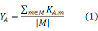
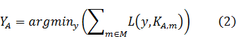
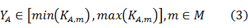
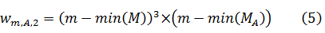
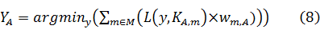

<h1 align="center">IJCAI-17 口碑商家客流量預測&emsp;解決方案說明</h1>

<b>CAT國際數據挖掘團隊&emsp;A分隊</b>

<b>2017年3月25日</b>

 
<h2>目录</h2>
&emsp;&emsp;<a href="#A1">一、综述</a> 
&emsp;&emsp;<a href="#A2">二、线下测试集</a> 
&emsp;&emsp;<a href="#A3">三、回归</a> 
&emsp;&emsp;<a href="#A4">四、加权</a> 
&emsp;&emsp;<a href="#A5">五、周期（一）</a> 
&emsp;&emsp;<a href="#A6">六、周期（二）</a> 
&emsp;&emsp;<a href="#A7">七、周期（三）</a> 
&emsp;&emsp;<a href="#A8">八、天气</a> 
&emsp;&emsp;九、优化 
&emsp;&emsp;十、总结 
&emsp;&emsp;<a href="#A11">注释</a> 
<a name="A1" />
 
<h3>一、综述</h3>
&emsp;&emsp;对于本场比赛的赛题，我们采用适合一般时间序列问题的时间序列加权回归模型（SJH）<a href="#B1">[1]</a>。 
<a name="A2" />
 
<h3>二、线下测试集</h3>
&emsp;&emsp;根据对赛题的理解，我们选取了2016.10.18到2016.10.31共计14天、全部2000个商家的客流量作为线下测试集。我们首先在线下进行优化，并选择在线下有效的方法提交到线上进行验证。我们始终确保我们的提交到线上的方法均经过线下测试，这是我们的成绩得以快速提升的重要原因之一。本次比赛，在排除国庆节等干扰后，线上下的变化基本能够保持一致。 
<a name="A3" />
 
<h3>三、回归 </h3>
&emsp;&emsp;　我们将2016.10.11-2016.10.31及2016.9.20-2016.9.26共计28天作为训练时间段。选择这28天的原因是，这28天是距离测试时间段最近并且不受2016年的国庆节及中秋节影响的28天，而更久远的时间段与测试时间段之间的差异过大，没有被包含在其中。
一个最基本的思路是，对于每个商家，将测试时间段的14天的客流量预测为其训练时间段的客流量的均值，即

式中，YA为商家A的预测值；M为训练时间段日集；|M|表示训练时间段的日数；KA,m表示商家A在日m的客流量值。我们把均值看做是对训练时间段的客流量的回归，那么显然我们可以找到一个比均值更优秀的回归值，这个回归值应该满足在训练时间段的28天上的损失值最小。我们将这个值作为这个商家在待测的14天上的预测。即

式中，L为赛题给定的损失函数。显然YA满足

由于小于1的预测值差异对成绩的影响基本可以忽略，在实际的实现中，为简单起见，我们遍历(3)所确定的范围内的所有整数，选择其中最优秀的YA。 
<a name="A4" />
 
<h3>四、加权 </h3>
&emsp;&emsp;通过对数据的观察和对问题的分析，我们发现商家的经营情况是不断变化的，越靠近测试时间段的样本重要性越大；此外，相对于老商家，一个刚刚开始营业的商家对这个重要性应该更加敏感。因而我们给选取的每一天加上一个权重，使得越靠近测试时间段的样本的权重越大，同时对于一个商家，越远离该商家开始营业的时间的样本的权重越大。经过线下测试，我们设计了如下三个权重函数：

式中MA表示商家A的所有营业的日子；m0表示待测时间段的首日；两日相减表示二者的日数距离。我们将(4)、(5)、(6)三者融合，得到最终采用的权重函数

式中α，β，γ均为0，1之间的实数且满足α+β+γ=1。依据线下测试，我们选择了合适的α，β，γ<a href="#B2">[2]</a>，并将(2)式改进为如下的形式

 
<a name="A5" />
 
<h3>五、周期（一） </h3>
&emsp;&emsp;通过对数据的观察和对问题的分析，我们发现商家的客流量具有明显的周期性，而且不同商家的周期性不同。例如一些美食商家周末的客流量更低，而一些超市受周末的影响不大，而不同的美食商家的情况也不相同。为此，我们设计了曜日权重函数<a href="#B3">[3]</a>

其中，ψ1为训练时间段中的一个曜日；ψ2为测试时间段的一个曜日。v是曜日权重函数，且满足若当ψ1，ψ2同为工作日或同为周末时，该函数得返回值较大，否则返回值较小。凭借对数据的观察，并依据线下测试集，我们确定了v的形式。此时，(8)被改进为

式中，μ 为测试时间段的一天；ψ(a)表示a日的曜日。 
<a name="A6" />
 
<h3>六、周期（二） </h3>
&emsp;&emsp;(9)的问题是对样本的利用程度不高，预测某一天时，不能尽用每一个样本。而时间序列问题的特点是时间样本较少，因而样本利用程度非常重要。为此，我们又做了如下的改进。 
 
&emsp;&emsp;我们选取排除掉节日等异常因素的近六个月及前一年的同一时期作为第二训练时间段<a href="#B4">[4]</a>。在这个时间段上，我们为每个曜日计算出一个最优系数，即能够在乘以这个系数后最小化损失值的系数，即

式中，pA,ψ表示商家A在曜日ψ上的曜日占比；M’表示第二训练时间段的日集，M’ψ表示第二时间段上属于曜日ψ的日集。Y(8),A,m表示以m所在周作为训练时间段，利用(8)的形式对商家A在m日的客流量做出的预测。我们排除训练样本中的周期性成分，然后重新加在对测试时间段的预测中，即

<a name="A7" />
 
<h3>七、周期（三） </h3>
&emsp;&emsp;(11)式的问题是曜日占比pA,ψ难以准确计算。由于(10)和(11)各有优缺点，我们将二者加权相加，即

式中δ，ε均为0，1之间的实数且满足δ+ε=1。依据线下测试，我们选择了合适的δ，ε<a href="#B2">[2]</a>。 
<a name="A8" />
 
<h3>八、天气 </h3>
 
待续
 
 
<a name="A11" />
 
<h3>注释</h3>
<a name="B1" />
[1]&emsp;<strong>SJH模型</strong>&emsp;关于该模型的资料， 请参阅<a href="about:blank" target="_blank">SJH模型</a>； 
<a name="B2" />
[2]&emsp;<strong>α，β，γ，δ，ε</strong>&emsp;事实上这些参数非常不敏感，我们仅在合理的范围内做了大致的调节； 
<a name="B3" />
[3]&emsp;<strong>曜日</strong>&emsp;星期某；<strong>曜日權重函數</strong>&emsp;代码中的<code>Qdyrqz</code> 即表示这个函數； 
<a name="B4" />
[4]&emsp;<strong>第二训练时间段</strong>&emsp;代码中的<code>c(-1:-21, -36:-42, -120:-133, -148:-175, -190:-203, -365:-378)</code> 即表示这个时间段； 
 
 
 
 
 
 
 
 
 
 
 
 
 
 
 
 
 
 
 
 
 
 
 
 
 
 
 
 