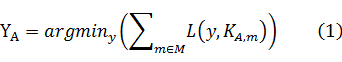

<h1 align="center">IJCAI-17 口碑商家客流量預測 解題思路</h1>

<b>CAT國際數據挖掘團隊</b>

<b>2017年3月25日</b>

 
<h3>描述 </h3>
&emsp;&emsp;我们将2016.10.11-2016.10.31及2016.9.20-2016.9.26共计28天作为训练时间段。选择这28天的原因是，这28天是距离测试时间段最近并且不受2016年的国庆节及中秋节影响的28天。 
对于每个商家，选取该商家在训练时间段的客流量样本；我们选择一个值，使得该值在训练时间段的28天上的损失值最小，并将它作为这个商家在待测的14天上的预测。即

    (1)

式中，YA表示商家A的预测值；M表示训练时间段日集；L表示损失函数；KA,m表示商家A在日m的客流量值。显然YA满足

    (2)

为简单起见，我们遍历上式确定的范围内的整数，选择最优的YA。
 