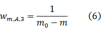
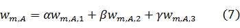

<h1 align="center">IJCAI-17 口碑商家客流量預測&emsp;解題思路</h1>

<b>CAT國際數據挖掘團隊&emsp;A分隊</b>

<b>2017年3月25日</b>

 
<h3>一、综述</h3>
&emsp;&emsp;  对于本场比赛的赛题，我们采用适合一般时间序列问题的时间序列加权回归模型（SJH）。 
 
<h3>二、线下测试集</h3>
&emsp;&emsp;根据对赛题的理解，我们选取了2016.10.18到2016.10.31共计14天作为线下测试集。我们首先在线下进行优化，并选择在线下有效的方法提交到线上进行验证。我们始终确保我们的提交到线上的方法均经过线下测试，这是我们的成绩得以快速提升的重要原因之一。本次比赛，在排除国庆节等干扰后，线上下的变化基本能够保持一致。 
 
<h3>三、回归 </h3>
&emsp;&emsp;　我们将2016.10.11-2016.10.31及2016.9.20-2016.9.26共计28天作为训练时间段。选择这28天的原因是，这28天是距离测试时间段最近并且不受2016年的国庆节及中秋节影响的28天，而更久远的时间段与测试时间段之间的差异过大，没有被包含在其中。
一个最基本的思路是，对于每个商家，将测试时间段的14天的客流量预测为其训练时间段的客流量的均值，即

式中，YA为商家A的预测值；M为训练时间段日集；|M|表示训练时间段的日数；KA,m表示商家A在日m的客流量值。我们把均值看做是对训练时间段的客流量的回归，那么显然我们可以找到一个比均值更优秀的回归值，这个回归值应该满足在训练时间段的28天上的损失值最小。我们将这个值作为这个商家在待测的14天上的预测。即

式中，L为赛题给定的损失函数。显然YA满足

由于小于1的预测值差异对成绩的影响基本可以忽略，为简单起见，我们遍历(3)所确定的范围内的所有整数，选择其中最优秀的YA。 
 
<h3>四、加权 </h3>
&emsp;&emsp;通过对数据的观察和对问题的分析，我们发现商家的经营情况是不断变化的，越靠近测试时间段的样本重要性越大；此外，相对于老商家，一个刚刚开始营业的商家对这个重要性应该更加敏感。因而我们给选取的每一天加上一个权重，使得越靠近测试时间段的样本的权重越大，同时对于一个商家，越远离该商家开始营业的时间的样本的权重越大。经过线下测试，我们设计了如下三个权重函数：

式中MA表示商家A的所有营业的日子；m0表示待测时间段的首日；两日相减表示二者的日数距离。我们将(4)、(5)、(6)三者融合，得到最终采用的权重函数

式中α，β，γ均为0，1之间的实数且满足α+β+γ=1。依据线下测试，我们选择了合适的α，β，γ，并将(1)式改进为如下的形式

 
 
<h3>五、周期性(一) </h3>